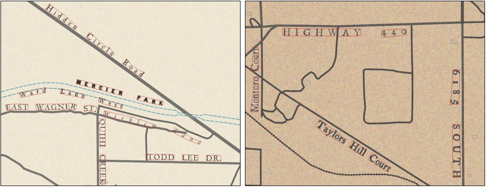

@yijun 

### Description 

The mapKurator system provides two state-of-the-art approaches for spotting text instances on scaned historical maps. Both approaches, <a href="https://github.com/mlpc-ucsd/TESTR" target="_blank">TESTR</a> and Spotter-v2, are built upon <a href="https://github.com/fundamentalvision/Deformable-DETR" target="_blank">Deformable-DETR</a>.

### Training Processs

- Training Datasets
  - Synthetic datasets: TBD 
    - We select 40k text-free background images from <a href="https://cocodataset.org/#home" target="_blank">COCO</a> and use them to generate synthetic text images. <b>Code:</b> <a href="https://github.com/ankush-me/SynthText" target="_blank">Github</a>; <b>Dataset:</b> TBD;
    - We propose an approach to generate synthetic maps that mimic the text (e.g., font, spacing, orientation) and background styles in the real historical maps. <b>Code:</b> TBD; <b>Dataset:</b> TBD;
    - The synthetic datasets are in English, Arabic, Russian, and Chinese. We use these datasets for training multilingual text spotters.
  - Human Annotations: TBD


    

- Text Spotters
  - <a href="https://github.com/mlpc-ucsd/TESTR" target="_blank">TESTR</a>
  - Spotter-v2: The appoach adopts a novel feature sampling strategy that samples relevant image features around the target points for predicting boundary points, which leads to enhanced detection and recognition performance. Code: TBD.

- Training Process
  - Pretrain: We train the TESTR and Spotter-v2 with the synthetic datasets.
  - Finetune: We finetune the models with human annotations.
  

### Inference Commands 

#### 1) Use run.py 

To run spotting, you can call `run.py` with the following command: 

```
python run.py --module_text_spotting 
              --sample_map_csv_path /home/maplord/maplist_csv/luna_omo_metadata_56628_20220724.csv
              --text_spotting_model_dir ./spotter-v2/PALEJUN/
              --expt_name sample_maps 
              --spotter_model spotter-v2
              --spotter_config ./spotter-v2/PALEJUN/configs/PALEJUN/SynthMap/SynthMap_Polygon.yaml
              --spotter_expt_name test
              --gpu_id 0
```

where

* `--module_text_spotting` turns on the spotting module in this run
* `--sample_map_csv_path` stores the metadata of the input map, a sample file can be found [here](https://drive.google.com/drive/folders/1Nby1JaIzNSwrGtGFn5Af0VL5y3TGLZGQ). 
* `--text_spotting_model_dir` switches to the model directory
* `--expt_name` is the experiment name for running the pipeline
* `--spotter_model` is the spotter model name, choices=["testr", "spotter-v2"]
* `--spotter_config` is the configuration file for running the spotting model
* `--spotter_expt_name` is the experiment name for running the spotter
* `--gpu_id` selects a GPU for running the spotter


#### 2) Use inference.py

If you do not have a metadata csv file, or wish to specify the input path of image directly, you can use `tools/inference.py` in the model folder (i.e., text_spotting_model_dir). 

```
CUDA_VISIBLE_DEVICES={gpu_id} python tools/inference.py 
                                  --config-file ./spotter-v2/PALEJUN/configs/PALEJUN/SynthMap/SynthMap_Polygon.yaml
                                  --output_json 
                                  --input ./test_images
                                  --output ./output

```
where

* `--config-file` is the configuration file for running the spotting model
* `--output_json` indicates the output file format is JSON
* `--input` is the input image directory
* `--output` is the output file directory

